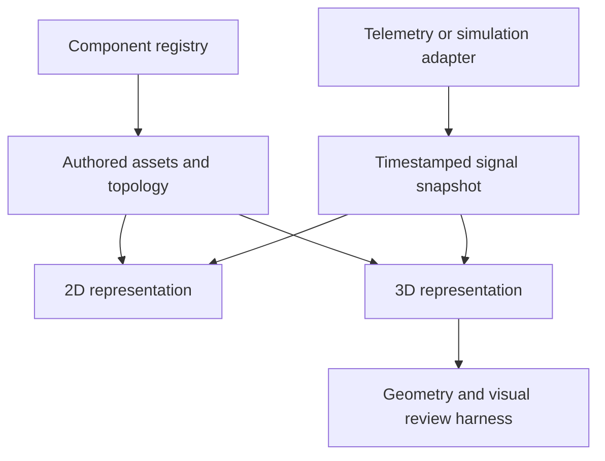

# SCADA equipment catalog and 3D foundation

This experiment tests a renderer-independent component contract and a repeatable geometry review loop. It is an isolated lab alongside the existing playground. It does **not** add 3D to the existing editor, change its DSL, or implement a digital twin.

## Sources and what enters the architecture

Checked 2026-09-08. Machine-readable provenance is in [`catalog/sources.json`](../catalog/sources.json).

| Source | Useful material | Integration in this change |
| --- | --- | --- |
| [draw.io P&ID stencils](https://github.com/jgraph/drawio/tree/dev/src/main/webapp/stencils/pid) | Vessels, pumps, valves, instruments, piping, filters, mixers, compressors and more | Searchable index of **478 symbol-name entries in 24 XML categories**, with source paths and blob SHAs. Variants are separate entries; this is not 478 equipment classes or working SCADA models. |
| [DEXPI specifications](https://dexpi.org/specifications/) | Process equipment, piping, instrumentation, physical quantities and relationships | Reference mappings for semantic equipment types. Current landing page describes DEXPI 2.0; explicit class links use the published [P&ID 1.4 equipment package](https://dexpi.org/static/pid_specification_1.4/reference/Equipment/index.html). No DEXPI interchange implemented. |
| [buildingSMART IFC / IfcPump](https://standards.buildingsmart.org/IFC/DEV/IFC4_3/HTML/lexical/IfcPump.html) | Equipment identity, placement, property sets and multiple geometric representations | Architectural reference for a future BIM adapter. The retrieved documentation page identifies a development build. No IFC import implemented. |
| [Symbol Factory Universal](https://softwaretoolbox.com/symbol-factory-universal/) | Broad industrial symbol library; SVG/XAML groups suitable for separate animation | Coverage and visual reference. The vendor requires a special license for embedding in commercial software products. No graphics copied. |
| [TraceParts](https://info.traceparts.com/) | Manufacturer CAD catalogs, 3D models and 2D drawings | Candidate input for dimensioned models, followed by port annotation and mesh simplification. No CAD downloaded or redistribution rights assumed. |

The draw.io repository root provides Apache-2.0. This change extracts only symbol names and categories from jgraph/drawio, adds provenance and adapts the format to JSON. Its license is retained in [`catalog/licenses/drawio-Apache-2.0.txt`](../catalog/licenses/drawio-Apache-2.0.txt). All three procedural meshes and the minimal schematic symbols are original code. DEXPI P&ID 1.4 is attributed to DEXPI e.V.; its [specification license](https://dexpi.org/static/pid_specification_1.4/#license) is CC BY 4.0. No specification prose or diagrams are copied.

3D SCADA already exists: [ICONICS GENESIS64](https://iconics.com/Products/GENESIS64) explicitly supports 2D/3D asset graphics. The opportunity here is a programmable, testable component model and useful operator interaction; rendering an industrial scene alone does not establish digital-twin fidelity.

## Catalog boundaries

A catalog entry can exist without a renderer or behavior implementation. Keep these capabilities explicit:

| Layer | Data | Current status |
| --- | --- | --- |
| Discovery | Name, category, source, license evidence, references | 478 draw.io entries + five source records |
| Semantics | Namespaced type, version, parameter schema, named ports, signal meanings | Three component definitions; independent registration API |
| Authored asset | Stable tag, physical parameters, `pose3D`, independent `layout2D` | Three fixtures |
| Runtime | `{value, unit, timestamp, quality}` per signal; separate alarm | Synthetic fixtures; no live adapter |
| Representation | Procedural mesh builder and update hook; minimal schematic glyph | Three 3D models and three 2D glyphs |
| Verification | Geometry checks, deterministic capture, OCR, designer review | Runnable Node/Playwright/Tesseract harness |

Suggested next families, using source categories rather than inventing a new closed `Kind` union:

| Family | Examples to implement | Additional semantics needed |
| --- | --- | --- |
| Storage | Vertical/horizontal tank, pressure vessel, silo | Level versus volume, working geometry, multiple nozzles |
| Fluid machinery | Centrifugal/reciprocating/rotary pump, compressor, fan | Drive feedback, signed measured flow, pressure, operating envelope |
| Valves | Isolation, control, check, relief, three-way mixing/diverting | Port roles, command/feedback, fail position; travel is not flow |
| Pipes and fittings | Pipe, elbow, tee, reducer, flange, strainer | Medium, bore, routing constraints, junction topology |
| Heat transfer | Plate/tubular exchanger, cooler, heater, boiler | Multiple independent circuits, thermal state |
| Treatment | Filter, separator, centrifuge, mixer, agitator | Differential pressure, fouling, multiple media and drives |
| Instrumentation | Flow, pressure, temperature, level, analyzer | Units, per-signal quality, timestamp, range, alarm semantics |
| Electrical/material handling | Motor, generator, conveyor, feeder | Different port domains and behaviors; not a fluid-only graph |

## Why Z is only part of the change

`src/next/model.ts` contains no Three.js dependency. The physical convention is **metres, right-handed, Z-up**, with unit quaternions and local port normals. The 2D drawing has independent coordinates. Old editor pixel coordinates are not silently reinterpreted as metres.

The intended separation is:



`src/next/components.ts` registers a vertical tank, centrifugal pump and three-way diverting valve. The valve has named AB/A/B ports, independent command and feedback, and three separately declared flows. Renderer registration is in `lab3d/models.ts`. The lab is an opt-in consumer; legacy `SceneView` and the DSL do not consume this registry yet.

Tank level describes liquid **height** in a vertical cylindrical working volume. Its cutaway is conditional visualization, not an open vessel design. The prototype rejects tank pitch/roll because a tilted tank requires clipping liquid against a world-horizontal plane and a different level interpretation. Pump and valve meshes support arbitrary pose rotation; the test checks transformed port position and normal.

Motion is symbolic. Pump rotor phase is integrated from drive RPM at a deliberately slowed display speed. Flow arrows use signed flow measurements. Setting flow to zero does not stop a running rotor, and reversing fluid does not reverse the motor. Unknown/bad/stale/offline flow hides arrows; unknown level hides liquid rather than inventing zero. Scenario changes preserve rotor phase; deterministic seeking resets the display clock explicitly.

## Run and reproduce

Use the Node version declared by the repository and `npm ci`.

```sh
npm run lab             # Build and serve on http://127.0.0.1:4174/
npm run check           # Existing checks plus contract/geometry tests and lab build
npx playwright install chromium
npm run lab:capture    # Requires tesseract and its English language data
```

`SCADA_CHROMIUM=/path/to/chromium npm run lab:capture` selects a preinstalled browser. The harness serves its own localhost instance and closes it after capture. All JS is bundled locally; the lab makes no external asset requests. `.lab-dist/standalone.html` is a self-contained local demo generated by the build.

Captures and `report.json` go to `.lab-evidence/`. The capture matrix covers four overview cameras; isolated components; tank empty/full; pump running at zero flow, reverse flow and stopped; valve mismatch; stale/bad/offline and trip. It also captures four deterministic animation frames and a 390px mobile page.

The process is **definition → generated geometry → numerical assertions → rendered frames → OCR + designer review → corrections → repeat**. OCR checks selected tags and state words. It does not judge topology, hidden ports, physical meaning, animation smoothness or overall usability. Screenshots are reviewed as images; numerical checks provide independent geometric/state evidence. Passing a triangle budget is not an FPS benchmark.

## Boundaries before a production 3D SCADA or digital twin

Still required: legacy DSL/registry integration and migration; persisted arbitrary topology and assemblies; port-domain validation; renderer lifecycle/disposal and LOD; robust hit testing and alarm aggregation; per-signal freshness policies; replay/history; telemetry adapters; authenticated command handling; model/version migrations; large-scene performance measurements; validated physical models; and real equipment calibration.

The lab pipe routes are authored demo routes, not an obstacle-aware 3D router. The example flow split is synthetic fixture data, not a hydraulic solver or a consequence of valve travel. Empty/full and quality scenarios are visual test inputs, not a physically consistent process simulation. There is no STEP/IFC/glTF importer, no manufacturable mesh promise, and no claim of standards compliance. The registry is an experimental API and remains mutable; it is not a sandbox for untrusted third-party code.
