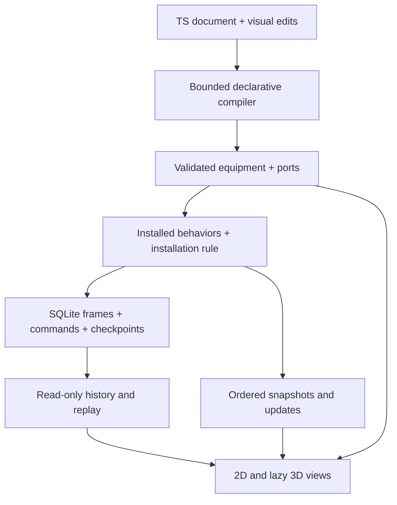

# Architecture

The authored project is one TypeScript document. Equipment configuration is separate from server runs, commands, actual equipment state and sensor observations. A runtime frame never becomes a CodeMirror transaction, a local-storage write or a source edit.

## Contracts and ownership

| Layer | Source of truth | Files |
|---|---|---|
| Authored configuration | Exact TS, shared by code/drag/inspector/undo | `src/source.ts`, `src/main.ts` |
| Component metadata | Installed definitions: fields, ports, signal units and commands | `src/core.ts`, `src/components/*/definition.ts` |
| Behavior | Fixed-step installed server modules | `server/behavior.ts`, `server/models.ts`, component `behavior.ts` |
| Installation | Explicit generic series rule connects published outputs | `server/engine.ts` |
| Durable run | Manifest, initial conditions, seed, behavior versions, commands, observations, private events and checkpoint | `server/store.ts` |
| Transport | Typed quality, run ID, sequence and model time | `src/runtime/protocol.ts`, `src/runtime/client.ts` |
| Runtime workspace | Selected run, connection, local replay position; credentials only in memory | `src/runtime/workspace.ts` |
| Geometry and presentation | Derived routes, SVG anatomy, spatial geometry, disposable animation phases | `src/geometry.ts`, `src/view.ts`, `src/view3d.ts` |

`runtime({server, project, run?})` is data. Opening a file, decoding a shared URL or compiling source cannot connect, issue commands or execute uploaded code. The destination is displayed before an explicit connection. Credentials are provided separately in the connection panel and are never serialized into TS or a share link. Changing equipment configuration detaches the old run; a configuration hash prevents overlaying incompatible equipment states. Transport settings and variable aliases do not affect that hash. The exact source is still retained in the private provenance manifest.

The server runs one 100 ms step at a time and commits its frame, hidden checkpoint, events and accepted command atomically. Browsers can pause visuals or close without pausing execution. A closed stream makes observations unknown and shows loss of connection. Reconnection obtains a complete latest snapshot; skipped time remains available in durable history. Frames from another run or malformed/out-of-order updates are rejected. Commands have idempotency IDs. Completing a recording is an explicit operator action.

The diagnostic boundary is the public observation stream: measured signals, quality, observable mode/alarm and generic events. Pump impeller wear, random state, scenario label and behavior assumptions are exposed by the research endpoint only. New runs use neutral public labels; a researcher preparing blind datasets must also exclude any manually supplied revealing labels and project names. No diagnostic model is trained here.

## Installing another equipment type

The running editor includes `filter` as a complete small extension, separate from the eight legacy components:

1. `src/components/filter/definition.ts` calls `registerComponent('filter', definition)` with versioned fields, physical port roles, units and command schemas.
2. `src/components/filter/behavior.ts` exports a behavior module with `initialize`, `advance`, `output` and `command`. Outputs participate in the generic installation through `process.conductance`.
3. `src/components/filter/visual.ts` registers both `registerSvgRenderer` and `register3dRenderer`. The 3D factory receives Three through its context; type-only imports keep Three out of the initial bundle.
4. Composition roots import metadata (`src/components/installed.ts`), visuals (`src/visual-components.ts`) and register behavior (`server/models.ts`). These are installation lists, not compiler or renderer branches.
5. Use `component("filter", "FLT-101", {x: 600, y: 200, resistance: 0.1})`. The existing compiler, inspector, palette, ports, source patcher and undo work from metadata.

A third-party package can use the same public registration functions. It is trusted installed code, not executable source sent by a browser. Registry duplicates and unsafe member names are rejected. The independent tests register an additional type and the server tests register another behavior without changing central algorithms. The shipped filter test verifies its effect on downstream flow and its `clean` command.

2D and 3D use the same equipment IDs and runtime frames. Custom renderers receive observation accessors, phase/smoothing helpers and generic quality/alarm context. Missing values are `null`, never fabricated zero. Flow direction, measured RPM and alarms are independent. Alarm indication bypasses smoothing; parameter edits retain geometry and animation phase. Reduced motion freezes motion without stopping telemetry or removing quality indicators.

## Deliberate boundaries

- The TS editor remains a bounded declarative subset, with at most 48 equipment items. It is not a general TypeScript runtime or a full language server.
- Routing remains synchronous; A* now uses a heap rather than sorting the entire frontier for each step. Large layouts can still block an edit briefly.
- The main 3D view derives a schematic placement from 2D coordinates. It supports orbit, selection and inspection; it is not a CAD layout editor and does not claim surveyed physical coordinates. The separate lab preserves metre-based transforms and port normals for future spatial authoring.
- The server applies one source/one driver/one sink per directed series line; independent lines are supported. Branching, hydraulic conservation, head curves, interlock verification and PLC interfaces are not implemented. Unsupported graphs publish unknown flow and an event.
- SQLite stores full frames for exact replay. This is a reproducible local scenario recorder, not a compressed multiyear historian. Partitioning, retention, calibration pipelines and independently held-out diagnostic datasets remain future work. Preserve position IDs and instance replacement events when building those datasets.
- Access roles apply to the local server as a whole. There is no multi-tenant authorization or automatic migration of old behavior checkpoints. Behavior-version mismatch fails startup explicitly.

See [wire contract](runtime-contract.md), [server guide](server-runtime.md), [DSL](dsl.md) and [runtime verification](runtime-validation.md).
