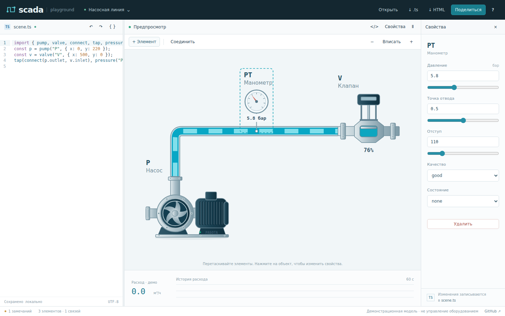
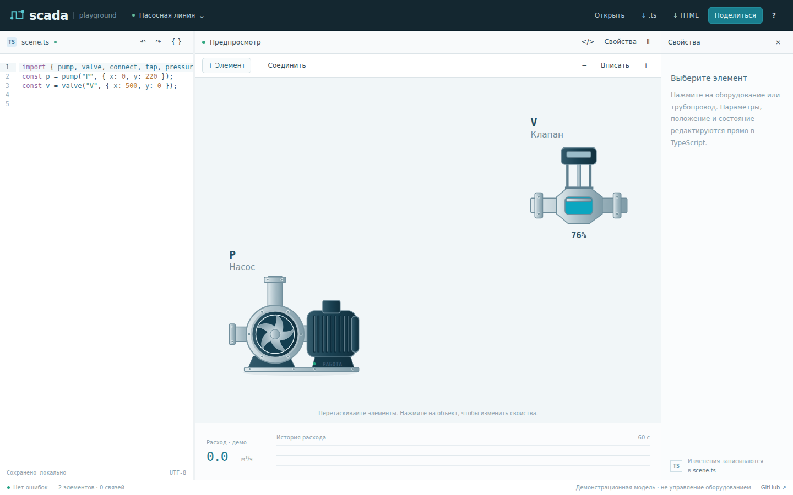
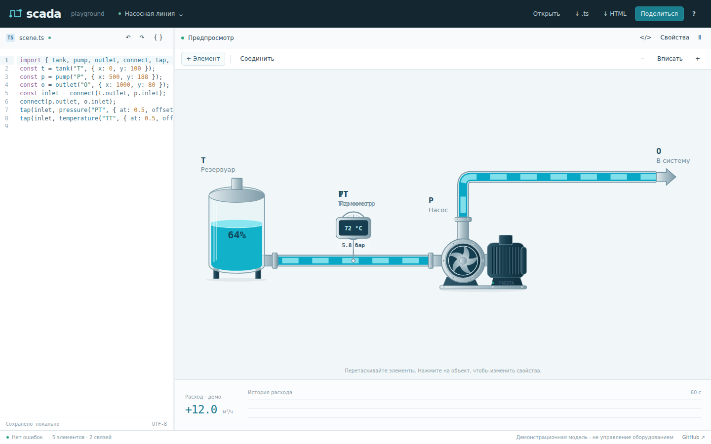

# SCADA: результаты challenge

Проверен `main` на коммите [`8e938be`](https://github.com/Pom4H/scada/commit/8e938beb46d9659458cd2c7bf43d9fafcbd700af), 8 сентября 2026 года.

**Фреймворк выдерживает обычные сценарии, но пока нарушает собственные гарантии при редактировании исходника и отображении истории.** На сложной допустимой схеме из 48 элементов трассировка блокирует интерфейс примерно на секунду при изменении координат. Расширять каталог оборудования до устранения этих проблем преждевременно.

В challenge добавлены исполняемые проверки и измерения. Реализация в `src/` не изменена. Это набор требований к исправлению, а не PR с исправлениями.

## Результат

| Проверка | Прошли | Упали |
| --- | ---: | ---: |
| Существующие тесты ядра | 38 | 0 |
| Существующие браузерные тесты, Chromium | 18 | 0 |
| Challenge ядра, C01–C14 | 8 | 6 |
| Challenge браузера, B01–B07 | 3 | 4 |

В 21 новой проверке — 10 падений. Два браузерных теста повторяют проблемы, найденные в ядре: **восемь разных дефектов/несогласованных контрактов и отдельное узкое место производительности**. C05 и B04 задают более строгие требования к достоверности показаний; это осознанные изменения контракта, а не утверждение, что такие требования уже покрывает существующий тестовый набор.

Сборка и текущая проверка типов проходят. Локальное окружение: Linux x64, AMD EPYC 9V74, 8 доступных логических CPU, Node 24.19.0, Playwright 1.63.0, headless Chromium 149.0.7827.0, esbuild 0.28.2. Загруженный Compiler API сообщает TypeScript 6.0.3. Node отличается на одну patch-версию от требуемого проектом 24.20.0; Chromium предоставлен `@sparticuz/chromium@149.0.0`, поскольку загрузка браузеров с Playwright CDN завершалась таймаутом. WebKit локально не проверен. Отдельный CI workflow запускает обе браузерные конфигурации; его результат следует смотреть отдельно от этих локальных измерений.

## Что сломалось

| Приоритет | Сценарий | Наблюдение | Проверка |
| --- | --- | --- | --- |
| P1 | Удалить манометр, созданный внутри `tap(connect(...), pressure(...))` | Вместе с прибором исчезает трубопровод, хотя он не выбран для удаления | C01, B01 |
| P1 | Переключить «Насосную линию» на «Два контура» | График соединяет старые +9.12 и новые +12 м³/ч как историю одного сигнала | B03 |
| P1 | Оборвать последовательный контур | Диагностика сообщает, что расчёт невозможен, но расходомер показывает достоверный на вид ноль | C05 |
| P2 | Добавить второй прибор к вложенному `connect` | Допустимый исходник перестаёт поддерживать действие инспектора; добавление завершается `SourceError` | C02 |
| P2 | Добавить резервуар при наличии скалярного `const tank = 20` | Генератор импортирует занятое имя; операция заканчивается «Повторное имя: tank» | C03 |
| P2 | Задать двум приборам одинаковые `at` и `offset` | Манометр, термометр и подписи накладываются; редактор сообщает «Нет ошибок» | C06, B02 |
| P2 | Поставить preview на паузу на 10 секунд | После продолжения график рисует непрерывную линию через интервал без отсчётов | B04 |
| P2 | Передать около 6 тысяч символов с 3000 вложенных скобок | Парсер выбрасывает `RangeError: Maximum call stack size exceeded` до проверки глубины DSL | C04 |

P1 означает высокий приоритет для целостности проекта и достоверности отображения; P2 — следующий приоритет. Эти обозначения не являются оценкой промышленной безопасности: проверяется браузерный workbench.

### Удаление манометра меняет топологию

Минимальный исходник, который успешно принимает компилятор:

```ts
import { pump, valve, connect, tap, pressure } from "@scada/core";
const p = pump("P", { x: 0, y: 220 });
const v = valve("V", { x: 500, y: 0 });
tap(connect(p.outlet, v.inlet), pressure("PT", { at: 0.5, offset: 110 }));
```

После удаления PT остаются только насос и клапан: `scene.links.length` меняется с 1 на 0. Это подтверждено вызовом `removeObject` и кнопкой «Удалить» в настоящем браузере. Причина: [`removeObject`](https://github.com/Pom4H/scada/blob/8e938beb46d9659458cd2c7bf43d9fafcbd700af/src/source.ts#L166) удаляет целый statement, общий для прибора и соединения. [`appendTap`](https://github.com/Pom4H/scada/blob/8e938beb46d9659458cd2c7bf43d9fafcbd700af/src/source.ts#L196) тоже опирается на statement: имя присваивается результату `tap`, а не вложенному `connect`.

Исправление должно работать с диапазоном конкретного вызова и его зависимостями. Альтернатива — явно отклонять неподдерживаемую форму ещё при компиляции. Тихо менять принятый проект при удалении прибора нельзя.

До удаления:



После удаления:



### История должна принадлежать конкретному сигналу

[`historySamples`](https://github.com/Pom4H/scada/blob/8e938beb46d9659458cd2c7bf43d9fafcbd700af/src/main.ts#L308) живёт в одном массиве, не привязанном к проекту или ID канала. Обработчик смены примера его не сбрасывает. После перехода к другому контуру в одном SVG path остаются точки обоих источников.

При паузе отсчёты не добавляются, но после продолжения соседние по массиву точки соединяются независимо от временного расстояния. Для графика реальных отсчётов нужен разрыв при превышении допустимого интервала либо явно замороженная временная шкала. Текущее поведение визуально заполняет неизвестный интервал.

Нужно хранить идентичность канала и качество/временные разрывы отсчёта. При смене проекта или канала — сбрасывать историю либо показывать отдельную серию. Важный положительный результат: переход `good → bad → good` уже создаёт настоящий разрыв и проходит B06.

### Ноль и отсутствие расчёта

В [`simulate`](https://github.com/Pom4H/scada/blob/8e938beb46d9659458cd2c7bf43d9fafcbd700af/src/core.ts#L83) `flow` изначально равен 0. Неполный контур добавляет замечание, оставляя ноль. Существующий тест `disconnected circuits do not invent flow` закрепляет именно это поведение.

C05 намеренно оспаривает этот контракт: `0` должен означать рассчитанный остановленный поток, `null` — отсутствие известного значения. UI уже умеет показывать `null` как «—», поэтому не требуется придумывать ещё один формат неизвестного показания.

### Геометрия приборов не участвует в проверке столкновений

В [`layout`](https://github.com/Pom4H/scada/blob/8e938beb46d9659458cd2c7bf43d9fafcbd700af/src/geometry.ts#L95) проверяются bounding boxes физического оборудования. Приборы исключены. Проверка длины горизонтального участка не ловит наложение нескольких приборов, их подписей и отводов.



Нужна отдельная стадия размещения/проверки приборов и подписей после трассировки. При невозможности размещения редактор должен назвать конфликтующие приборы.

### Ограничение глубины наступает после парсинга

Проверка `depth > 80` находится в интерпретаторе выражений. [`ts.createSourceFile`](https://github.com/Pom4H/scada/blob/8e938beb46d9659458cd2c7bf43d9fafcbd700af/src/source.ts#L20) вызывается раньше. Вложенные скобки переполняют стек парсера при размере намного меньше разрешённых 120 000 символов.

Это воспроизведённая ошибка границы API, а не доказательство выполнения произвольного кода или краша вкладки: оболочка редактора перехватывает исключение. Для ограничения затрат нужен парсинг в Worker с лимитом времени; как минимум — нормализованная диагностика вместо необработанного `RangeError` из `compile`.

## Производительность

Seed 42, один полный последовательный контур, оборудование разнесено без пересечений, связи перемешаны, чтобы трассы обходили препятствия. Все 8/16/32/48-элементные схемы дают ноль предупреждений. Для каждого размера: один прогрев и три замера; ниже медианы. Генератор: [`challenges/fixtures.ts`](../challenges/fixtures.ts), сырые данные: [`benchmark.json`](challenge-evidence/benchmark.json).

| Элементы | Соединения | Компиляция, мс | Трассировка, мс |
| ---: | ---: | ---: | ---: |
| 8 | 7 | 1.66 | 2.48 |
| 16 | 15 | 1.34 | 8.93 |
| 32 | 31 | 2.06 | 177.92 |
| 48 | 47 | 1.94 | 991.57 |

Измерение редактора в Chromium подтверждает блокировку на изменении координат: примерно 1 секунда на один синхронный `setSource` с перемещением на одну единицу. Параметрические изменения намного дешевле благодаря существующему кешу геометрии. Точные отсчёты текущего браузерного прогона сохранены в [`browser-summary.json`](challenge-evidence/browser-summary.json).

В [`routeLink`](https://github.com/Pom4H/scada/blob/8e938beb46d9659458cd2c7bf43d9fafcbd700af/src/geometry.ts#L68) очередь сортируется на каждой итерации; каждый маршрут строит собственную сетку препятствий. При изменении позиции [`SceneView.render`](https://github.com/Pom4H/scada/blob/8e938beb46d9659458cd2c7bf43d9fafcbd700af/src/view.ts#L83) синхронно пересчитывает всю сцену. Это кандидаты для оптимизации по коду, а не результат профилирования отдельных функций.

Следующий шаг: вынести трассировку из главного потока, заменить полную сортировку очереди на priority queue, переиспользовать индекс препятствий и инвалидировать затронутые маршруты. Нужен общий бюджет времени на раскладку. Числа выше относятся к специально трудной схеме на общей вычислительной среде; это не FPS устройства и не потолок для любой схемы из 48 элементов.

## Что выдержало проверку

- 201 переход через положительные, нулевые и отрицательные RPM: знаки расчётного потока согласованы во всех трубах.
- 120 обновлений RPM в браузере: узлы SVG сохраняются, обратный поток действительно движется в обратном направлении.
- Trip, сухой резервуар и закрытый клапан немедленно обнуляют расчётный поток.
- `bad` и `stale` делают поток неизвестным; потеря качества останавливает движение, восстановление оставляет разрыв на графике.
- Независимые контуры не заражают друг друга состояниями аварии и качества.
- 200 правок параметров сохраняют посторонние байты исходника; вычисляемые координаты защищены от перезаписи.
- 48 элементов проходят валидацию и сохраняют точные порты/свободные трассы; 49-й элемент отклоняется.
- Проверенные произвольные вызовы, циклы и доступ к prototype отклоняются без исполнения.

## Порядок исправления

1. Устранить потерю связей при AST-редактировании и корректно генерировать имена/импорты.
2. Развести ноль, неизвестный расход и временные разрывы; привязать историю к источнику.
3. Ограничить время трассировки, затем добавить диагностику пересечений приборов.
4. Защитить границу парсера и перенести тяжёлую работу в Worker.

Для следующего архитектурного challenge полезны регистрация нового вида оборудования без правок большого `if/else` в renderer и вход телеметрии с временем/качеством отдельно от конфигурационного `.ts`. Сейчас это направления расширения: реальный PLC-ввод, динамически расширяемый state и произвольная гидравлика не заявлены как реализованные возможности и не учитывались как дефекты.

Команды воспроизведения и ожидаемые падения — в [`challenges/README.md`](../challenges/README.md). Новый workflow **SCADA challenge** сохраняет ошибки как ошибки. Текущий release workflow продолжает проверять существующий набор.
