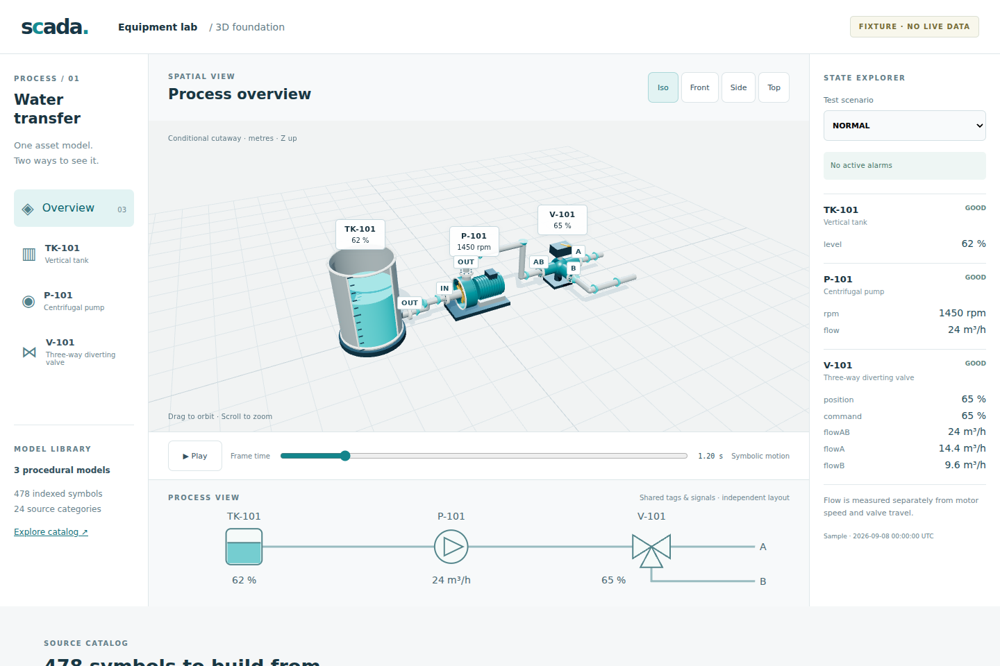

# Equipment lab review evidence

Captured 2026-09-08 from the actual Three.js application. Images are browser screenshots, not generated concept art.

## Verified in this iteration

- Existing 38 core tests passed; seven new contract/geometry/state tests passed.
- Main and lab TypeScript checks and both builds passed.
- Browser harness passed 18 deterministic state/view cases, mobile checks, catalog search, phase continuity/replay and standalone HTML startup.
- Tesseract recognized TK-101/P-101/V-101 in overview, TRIP in the alarm case, and OFFLINE/UNKNOWN in the unavailable-data case. The checked strings and raw OCR outputs are committed here.
- Maximum observed rendered geometry: 32,614 triangles and 260 draw calls for this small scene. These are recorded observations, not scalability limits or frame-rate guarantees.

The full machine-readable result is [`report.json`](report.json). The environment used Node 24.19.0 (the repository declares >=24.20.0) and Chromium 149.0.7827.0 with SwiftShader. The software renderer's six-second recording observed a mean frame interval of approximately 55.5 ms and a worst interval of 250 ms. Smooth 60 FPS and large-scene performance are **not** established.

## Independent designer feedback and correction

A separate 3D SCADA designer agent inspected the original screenshots, identified five issues and re-inspected the corrected renders:

| Finding | Correction | Follow-up result |
| --- | --- | --- |
| Unknown could look like a valid empty/stopped state | Quality badges attached to each 3D asset; in-scene warning; hatched unknown tank in 2D | Accepted for this prototype |
| 2D tank level line stayed at its midpoint | Fill and surface line now follow the shared level sample | Accepted |
| Mobile schematic text shrank too far | Scrollable schematic preserves drawing/text size; trip banner is visible above the fold | Accepted visually; overflow, text scale and control dimensions checked by browser |
| Valve B was hidden behind the actuator | B faces the default camera; all three nozzles visible; actuator endpoints labeled 0/A and 100/B | Accepted |
| Pump rotor appeared outside a closed casing | Open casing, bright cut edge, rotor inside shell | Accepted |

The reviewer accepted the **static visual iteration**, not animation smoothness or industrial correctness. Selected detail captures: [pump](pump.png), [valve](valve.png), [unavailable data](offline.png), [mobile](mobile.png).

## Motion evidence

[`motion.webm`](motion.webm) records the 3D canvas through normal → zero flow → reverse flow → offline. It excludes DOM labels, which are covered by the screenshots. The recording is evidence for inspection, not a designer approval of smoothness. Four nonuniform deterministic frame times (0, 0.13, 0.31, 0.72 s) are generated by the harness for rotor inspection.

Numerical assertions independently verify that reverse fluid does not reverse the motor, zero flow can coexist with rotating equipment, unavailable flow hides arrows, and a state transition preserves rotor phase. OCR cannot establish any of those properties.

Run `npm run lab:capture` to regenerate the complete matrix. See [architecture, sources and limitations](../3d-foundation.md).
